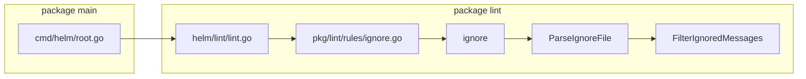

# HIP 0019 TODO

## map



## TODO

1. search expected paths in order for file
   2. What are the expected paths?
      3. ~/.lintignorefile
      4. ./chart-path/.lintignorefile
2. default to finding the file in the above paths
3. explicit `--lint-ignore-file=filePathHere` should take precedence

## Example lint file

```
# .helmlintignore file example 
template/test/test.sh  # Exclude this file from linting 
template/test/test.yaml  {{template "fullname" .}}  # Exclude this specific line from findings in this specific file (error is still detected but no output is generated)
```

## References

- [HIP-0019 writeup](https://github.com/danilo-patrucco/community/blob/helm_ignore_HIP/hips/hip-0019.md)
- [Working branch on Danilo's github](https://github.com/helm/helm/compare/main...danilo-patrucco:helm:HIP-0019)